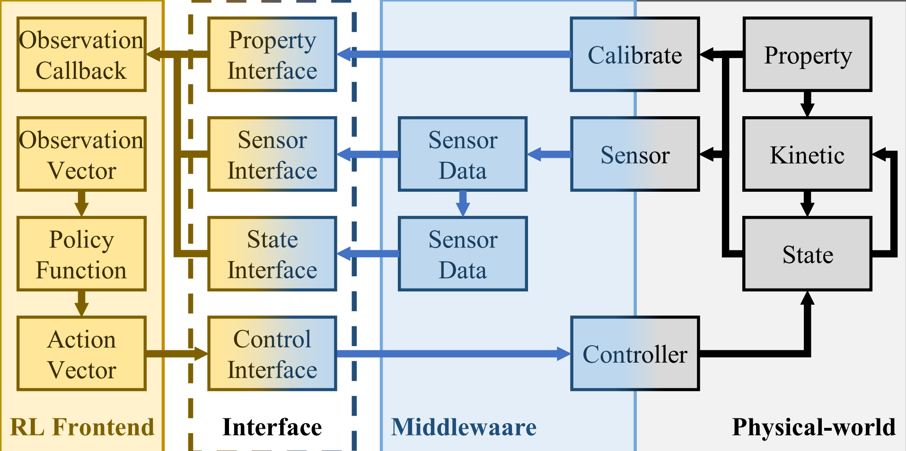

# NICS_MultiRobot_Platform
This is an experimental mulit-robot system that converts the ROS interface into a GYM-like interface.



In our paper, we provide unified sim-to-real interfaces and their paradigm as shown above, supporting the collaborative development of DRL policy and real robot systems.

In this repository, we have realized a middleware that subscribes to the corresponding topics and provides data through a unified data interface. The DRL algorithm can easily migrate from the simulation environment to the real robot system with our tool.


## Code Structure
```plaintext
.
├─docs/
├─scripts/
├─src/
│  ├─nics_robot_client/
│  ├─nics_robot_host/
│  ├─nics_robot_inference/
│  ├─velocity_tracker/
│  ├─vrpn_client_ros/
│  ├─xtark_driver/
│  ├─CMakeLists.txt
│  └─mac2id.py
├─.catkin_workspace
├─LICENSE
└─README.md
```
The main parts of our system are `nics_robot_host`, `nics_robot_client` and `nics_robot_inference` while `xtark_driver` and `vrpn_client_ros` are the specific hardware driver of robot (steering and lidar) and motion capture software used in our experiment.
- `nics_robot_host` is the central control node of whole system. It collects raw ROS data, parses them into correct form and send to `inference` node on each robot.
- `nics_robot_inference` includes independent instance of DRL algorithm. It obtains the perception data transmitted by the `host` node through ROS Service, and outputs the action to `client` node on each robot.
- `nics_robot_client` converts the output action of algorithm to the resolvable control instructions for real robot.


## Install
### Prerequisites
Python (3.8.10), OpenAI gym (0.18.3), ROS(ros-noetic-desktop), numpy (1.20.3)
### Instructions
Just install this repo by:
```shell
git clone https://github.com/efc-robot/NICS_MultiRobot_Platform.git
catkin_make
source devel/setup.bash
```


## Getting Started
We use robots produced by [XTARK](https://www.xtark.cn/) and customize `CAR_ID` for each agent. If you need to adapt your own robot, some hardware configuration parameters may need to be modified.

Simple startup instructions are as follows:
```shell
# start central control
roslaunch nics_robot_host robot_host.launch
# start client on each robot
roslaunch nics_robot_client robot_client.launch
# after embedding your RL algorithm, start inference on each robot
roslaunch nics_robot_inference inference.launch
```
Then start your experiment according to the interaction program provided by `host`.